# 📚 LMS-Dblock Project Onboarding Guide

Welcome to the team! This guide will help you understand our Library Management System (LMS-Dblock) and get you up to speed quickly.

## 🎯 What is LMS-Dblock?

LMS-Dblock is a **Flask-based Library Management System** designed for D-Block Library at GCE Erode. It handles book lending, user management, and library operations with a role-based permission system.

## 🏗️ Project Architecture Overview

### 📊 System Architecture Diagram
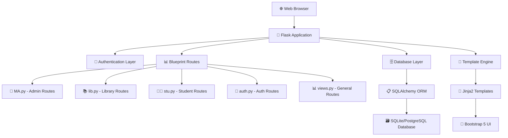

### 📁 Project Structure Tree
```
📁 LMS-Dblock/
├── 🐍 LMS_app.py              # Main Flask application entry point
├── 📋 requirements.txt         # Python dependencies
├── 📖 README.md               # Project documentation
├── 🌐 website/                # Main application package
│   ├── 🔧 __init__.py         # Flask app factory
│   ├── 🔐 auth.py             # Authentication routes
│   ├── 🗄️ models.py           # Database models
│   ├── ⚙️ config.py           # Configuration settings
│   ├── 📊 veiws.py            # Main view routes
│   ├── 📚 lib.py              # Library management routes
│   ├── 👨‍🎓 stu.py              # Student-specific routes
│   ├── 👑 MA.py               # Master Admin routes
│   ├── 🎨 templates/          # HTML templates
│   └── 📁 static/             # CSS, JS, images
├── 🗃️ migrations/             # Database migration files
├── 📄 instance/               # Instance-specific files (DB, logs)
└── 📝 scripts/                # Utility scripts
```

### 🧠 Application Components Mind Map
```
                    🏛️ LMS-DBLOCK SYSTEM
                           │
        ┌──────────────────┼──────────────────┐
        │                  │                  │
    🔐 AUTH           📊 CORE LOGIC      🎨 PRESENTATION
        │                  │                  │
    ┌───┴───┐          ┌───┴───┐          ┌───┴───┐
    │       │          │       │          │       │
  Login   Roles    Database  Business    Templates Static
    │       │          │       │          │       │
 Sessions Permissions Models  Workflows   HTML    CSS/JS
    │       │          │       │          │       │
 Flask-   Role-     SQLAlchemy Book      Jinja2  Bootstrap
 Login    Based      ORM      Management  Engine    5
         Access              Fine Logic
```

## 🎭 User Roles & Permissions

### 🏛️ Role Hierarchy Pyramid
```
                    👑 ADMIN
                   /         \
                  /   FULL    \
                 /   SYSTEM   \
                /    ACCESS    \
               /_________________\
              
              🎯 INCHARGE
             /             \
            /   MANAGEMENT  \
           /     LEVEL      \
          /___________________\
         
         🤝 VOLUNTEER
        /               \
       /   OPERATIONAL   \
      /      LEVEL       \
     /____________________\
    
    👨‍🎓 STUDENT
   /                \
  /    END USER     \
 /      LEVEL       \
/____________________\
```

### 🔐 Permission Matrix Flowchart
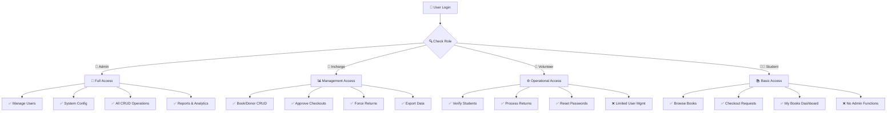

### 🎯 Role-Based Feature Access
```
┌─────────────────┬───────┬──────────┬───────────┬─────────┐
│ Feature/Action  │ Admin │ Incharge │ Volunteer │ Student │
├─────────────────┼───────┼──────────┼───────────┼─────────┤
│ 📚 Manage Books │  ✅   │    ✅    │     ❌    │   ❌    │
│ 🎁 Manage Donors│  ✅   │    ✅    │     ❌    │   ❌    │
│ ✅ Verify Users │  ✅   │    ✅    │     ✅    │   ❌    │
│ 📋 Approve Chkout│ ✅   │    ✅    │     ✅    │   ❌    │
│ 🔄 Force Return │  ✅   │    ✅    │     ✅    │   ❌    │
│ 🔄 Renew Books  │  ✅   │    ✅    │     ✅    │   ✅    │
│ 📖 Request Books│  ✅   │    ✅    │     ✅    │   ✅    │
│ 💰 Pay Fines    │  ✅   │    ✅    │     ✅    │   ✅    │
│ 📊 Export Data  │  ✅   │    ✅    │     ✅    │   ❌    │
│ 👥 User Mgmt    │  ✅   │    ✅    │  Limited  │   ❌    │
└─────────────────┴───────┴──────────┴───────────┴─────────┘
```
## 🗄️ Database Schema Overview

### 🗃️ Entity Relationship Diagram
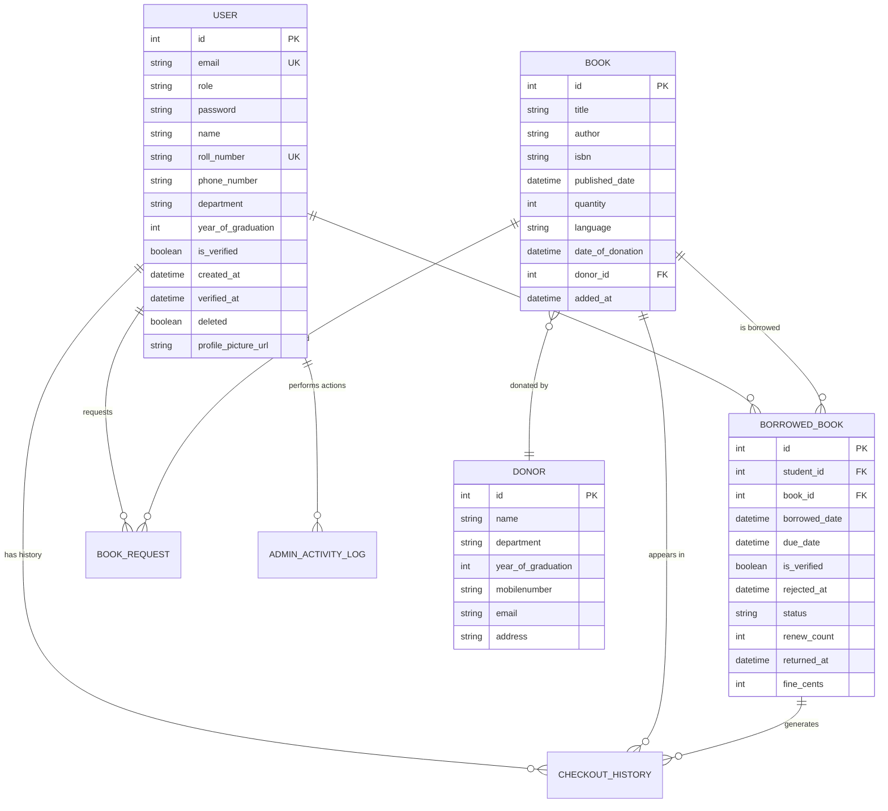

### 🧠 Database Models Mind Map
```
                    🗄️ DATABASE MODELS
                           │
        ┌──────────────────┼──────────────────┐
        │                  │                  │
    👤 USERS          📚 BOOKS           📊 TRACKING
        │                  │                  │
    ┌───┴───┐          ┌───┴───┐          ┌───┴───┐
    │       │          │       │          │       │
  Core    Auth      Inventory Donors    History  Status
  Info   System      Data    Info      Logs     Info
    │       │          │       │          │       │
  Name    Roles      Title   Contact   Checkout Library
  Email   Perms      Author  Details   Activity Status
  Dept    Verify     ISBN    Address   Requests Volunteer
  Year    Status     Qty     Grad      Fines    Schedule
```

### 📋 Model Relationships Flowchart
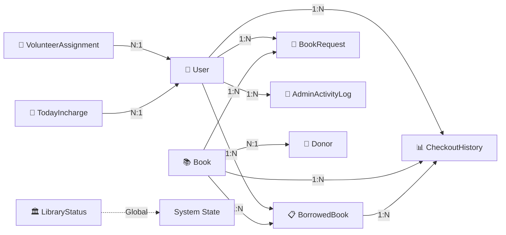

### 🔗 Key Model Details
```
👤 User Model (Central Hub)
├── 🆔 Primary: id, email, role, password, name
├── 🎓 Academic: roll_number, department, year_of_graduation
├── 📞 Contact: phone_number, profile_picture_url
├── ✅ Status: is_verified, created_at, verified_at, deleted
└── 🔗 Relations: books, borrowed_books

📚 Book Model (Inventory Core)
├── 🆔 Primary: id, title, author, isbn
├── 📅 Dates: published_date, date_of_donation, added_at
├── 📊 Inventory: quantity, language
├── 🎁 Donor: donor_id (FK)
└── 🔗 Relations: student, borrowed_by, donor

📋 BorrowedBook Model (Transaction Bridge)
├── 🆔 Primary: id, student_id (FK), book_id (FK)
├── 📅 Dates: borrowed_date, due_date, returned_at, rejected_at
├── 📊 Status: is_verified, status, renew_count
├── 💰 Finance: fine_cents
└── 🔗 Relations: student, book

🎁 Donor Model (Contributor Info)
├── 🆔 Primary: id, name, department
├── 🎓 Academic: year_of_graduation
├── 📞 Contact: mobilenumber, email, address
└── 🔗 Relations: books
```

## 🛠️ Technology Stack

| Component | Technology | Purpose |
|-----------|------------|---------|
| **Backend** | Flask 3.1.0 | Web framework |
| **Database** | SQLAlchemy 2.0.31 | ORM & database abstraction |
| **Authentication** | Flask-Login 0.6.3 | User session management |
| **Forms** | Flask-WTF 1.2.2 | Form handling & CSRF protection |
| **Migrations** | Flask-Migrate 4.0.5 | Database schema versioning |
| **Rate Limiting** | Flask-Limiter 3.8.0 | API protection |
| **Data Processing** | Pandas 2.2.3 | Excel exports & data manipulation |
| **Frontend** | Bootstrap 5 | Responsive UI framework |

## 🚀 Quick Start Guide

### 1. Environment Setup
```bash
# Create virtual environment
python -m venv .venv

# Activate virtual environment
.venv\Scripts\activate  # Windows
source .venv/bin/activate  # Linux/Mac

# Install dependencies
pip install -r requirements.txt
```

### 2. Database Setup
```bash
# Initialize database
flask db init

# Create migration
flask db migrate -m "Initial migration"

# Apply migration
flask db upgrade
```

### 3. Environment Variables
Create a `.env` file:
```env
FLASK_ENV=development
SECRET_KEY=your-secret-key-here
DATABASE_URL=sqlite:///instance/Kishorebase.db
FINE_PER_DAY_CENTS=100
```

### 4. Run the Application
```bash
python LMS_app.py
```
Visit: `http://localhost:8000`## 🔄 Appli
cation Flow & Key Features

### 📚 Complete Book Management Workflow
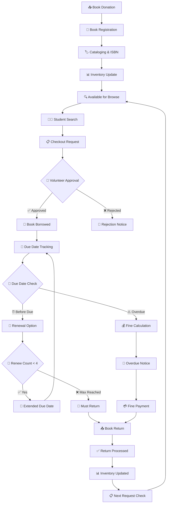

### 👨‍🎓 Student User Journey Map
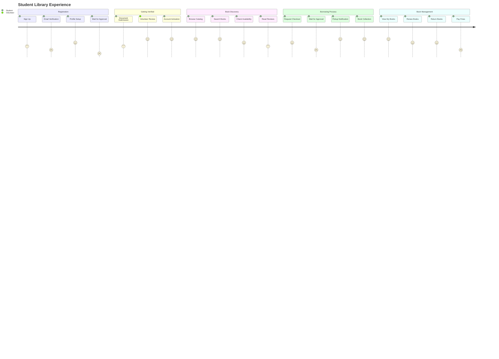

### 🔄 System State Flow Diagram
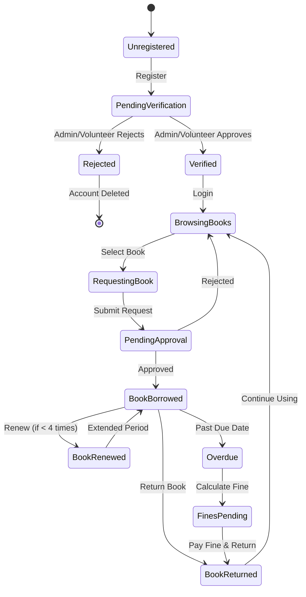

### 🔐 Authentication & Authorization
- **Flask-Login** handles user sessions
- **Role-based access control** throughout the application
- **CSRF protection** on all forms
- **Rate limiting** to prevent abuse

## 📁 Key File Structure Deep Dive

### 🌐 `/website` Directory (Main Package)
```
website/
├── 🔧 __init__.py          # App factory, blueprints, error handlers
├── 🔐 auth.py              # Login, logout, registration routes
├── 🗄️ models.py            # SQLAlchemy database models
├── ⚙️ config.py            # Environment-based configuration
├── 📊 veiws.py             # Home, dashboard, general routes
├── 📚 lib.py               # Library management (books, donors)
├── 👨‍🎓 stu.py               # Student-specific functionality
├── 👑 MA.py                # Master Admin operations
├── 📝 forms.py             # WTForms form definitions
├── 🧭 navigation.py        # Dynamic sidebar generation
├── 🔧 lib.py               # Utility functions
└── 📋 constants.py         # Application constants
```

### 🎨 `/templates` Directory
```
templates/
├── 🏠 BaseFormat.html      # Base template with navigation
├── 🏠 home.html            # Landing page
├── 🔐 login.html           # Authentication forms
├── 📊 *Dashboard.html      # Role-specific dashboards
├── 📚 *Books.html          # Book management templates
├── 👥 Manage*.html         # User management templates
└── ⚙️ Settings.html        # Configuration pages
```

### 📁 `/static` Directory
```
static/
├── 🎨 css/                 # Custom stylesheets
├── 🖼️ img/                 # Images and icons
└── ⚡ js/                  # JavaScript files
```

## 🎯 Core Business Logic

### 📖 Book Checkout System
- **Availability Check**: Ensures book quantity > 0
- **Student Verification**: Only verified students can checkout
- **Approval Workflow**: Volunteer/Admin approval required
- **Due Date Calculation**: Configurable lending period
- **Renewal Limits**: Maximum 4 renewals per book per student

### 💰 Fine Management
- **Automatic Calculation**: Based on `FINE_PER_DAY_CENTS` setting
- **Grace Period**: Configurable overdue grace period
- **Payment Tracking**: Fine payment history
- **Blocking Logic**: Prevent new checkouts with outstanding fines

### 📊 Request System
- **Out-of-Stock Requests**: Students can request unavailable books
- **Queue Management**: FIFO (First In, First Out) processing
- **Auto-Notification**: Notify when requested book becomes available

## 🔧 Configuration & Customization

### Environment-Based Config
- **Development**: Debug mode, local SQLite database
- **Production**: Secure settings, PostgreSQL support
- **Configurable Fines**: Adjust daily fine amounts
- **Rate Limiting**: Customizable API limits

### 🎨 UI/UX Features
- **Mobile-First Design**: Bootstrap 5 responsive grid
- **Dynamic Sidebar**: Role-based navigation
- **Real-time Updates**: AJAX for dynamic content
- **Export Functionality**: Excel export for reports## 🧭 
Navigation & User Interface

### 🎨 Dashboard Architecture Overview
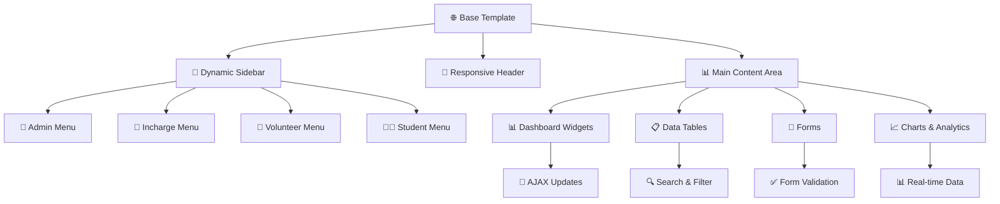

### 🎭 Role-Based Dashboard Layouts

#### 👑 Admin Dashboard Layout
```
┌─────────────────────────────────────────────────────────┐
│ 🏛️ ADMIN CONTROL CENTER                                │
├─────────────────┬─────────────────┬─────────────────────┤
│ 📊 System Stats │ 👥 User Mgmt    │ ⚙️ Settings        │
│ • Total Users   │ • Promote/Demote│ • System Config    │
│ • Total Books   │ • Verify Users  │ • Fine Settings    │
│ • Active Loans  │ • Role Changes  │ • Library Status   │
├─────────────────┼─────────────────┼─────────────────────┤
│ 📈 Analytics    │ 📋 Recent Activity                   │
│ • Usage Trends  │ • Latest Logins                      │
│ • Popular Books │ • Book Checkouts                     │
│ • Fine Reports  │ • System Changes                     │
└─────────────────┴─────────────────────────────────────────┘
```

#### 🎯 Incharge Dashboard Layout
```
┌─────────────────────────────────────────────────────────┐
│ 📚 LIBRARY MANAGEMENT HUB                              │
├─────────────────┬─────────────────┬─────────────────────┤
│ 📖 Book Mgmt    │ ✅ Approvals    │ 📊 Reports         │
│ • Add Books     │ • Checkout Queue│ • Lending Stats    │
│ • Edit Catalog  │ • Return Queue  │ • Overdue Books    │
│ • Donor Mgmt    │ • Renewal Req   │ • Popular Titles   │
├─────────────────┼─────────────────┼─────────────────────┤
│ 👥 User Verify  │ 📈 Quick Stats                       │
│ • Student Apps  │ • Today's Activity                   │
│ • Doc Review    │ • Pending Tasks                      │
│ • Bulk Actions  │ • System Alerts                      │
└─────────────────┴─────────────────────────────────────────┘
```

#### 🤝 Volunteer Dashboard Layout
```
┌─────────────────────────────────────────────────────────┐
│ 🤝 DAILY OPERATIONS CENTER                             │
├─────────────────┬─────────────────┬─────────────────────┤
│ ✅ Today's Tasks│ 👨‍🎓 Student Ops │ 📋 My Schedule     │
│ • Approvals     │ • Verify Accounts│ • Assigned Days    │
│ • Returns       │ • Reset Passwords│ • Partner Info     │
│ • Renewals      │ • Profile Updates│ • Shift Notes      │
├─────────────────┼─────────────────┼─────────────────────┤
│ 📊 Quick Stats  │ 🔔 Notifications                     │
│ • Pending Items │ • Overdue Alerts                     │
│ • Completed     │ • System Messages                    │
│ • Success Rate  │ • Task Reminders                     │
└─────────────────┴─────────────────────────────────────────┘
```

#### 👨‍🎓 Student Dashboard Layout
```
┌─────────────────────────────────────────────────────────┐
│ 📚 MY LIBRARY SPACE                                     │
├─────────────────┬─────────────────┬─────────────────────┤
│ 📖 My Books     │ 🔍 Browse       │ 📋 Requests        │
│ • Currently     │ • Search Catalog│ • Pending          │
│ • Due Dates     │ • New Arrivals  │ • Fulfilled        │
│ • Renewals Left │ • Categories    │ • History          │
├─────────────────┼─────────────────┼─────────────────────┤
│ 💰 Fines        │ 📊 My Stats                          │
│ • Outstanding   │ • Books Read                         │
│ • Payment Hist  │ • Favorite Authors                   │
│ • Due Alerts    │ • Reading Progress                   │
└─────────────────┴─────────────────────────────────────────┘
```

### 🧭 Navigation Flow Chart
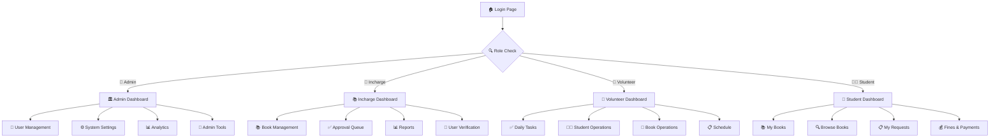

## 🔍 Key Features in Detail

### 🔐 Authentication System
```python
# Multi-layered security approach
- Password hashing with Werkzeug
- Session management with Flask-Login
- CSRF protection on all forms
- Rate limiting on sensitive endpoints
- Role-based route protection
```

### 📊 Data Export & Reporting
- **Excel Export**: Pandas-powered data exports
- **Custom Reports**: Filtered by date, user, book
- **Analytics**: Usage statistics and trends
- **Audit Trails**: Complete action logging

### 🔄 Real-time Features
- **Live Status Updates**: Library open/closed status
- **Dynamic Content**: AJAX-powered interactions
- **Instant Notifications**: Success/error messages
- **Auto-refresh**: Dashboard widgets update automatically

## 🛠️ Development Workflow

### 🔄 Development Process Flow
```mermaid
gitgraph
    commit id: "Main Branch"
    branch feature/new-feature
    checkout feature/new-feature
    commit id: "Start Feature"
    commit id: "Implement Logic"
    commit id: "Add Tests"
    commit id: "Update Docs"
    checkout main
    merge feature/new-feature
    commit id: "Deploy to Prod"
```

### 🔧 Development Lifecycle Diagram
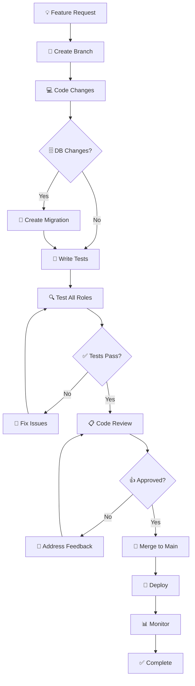

### 📝 Database Migration Workflow
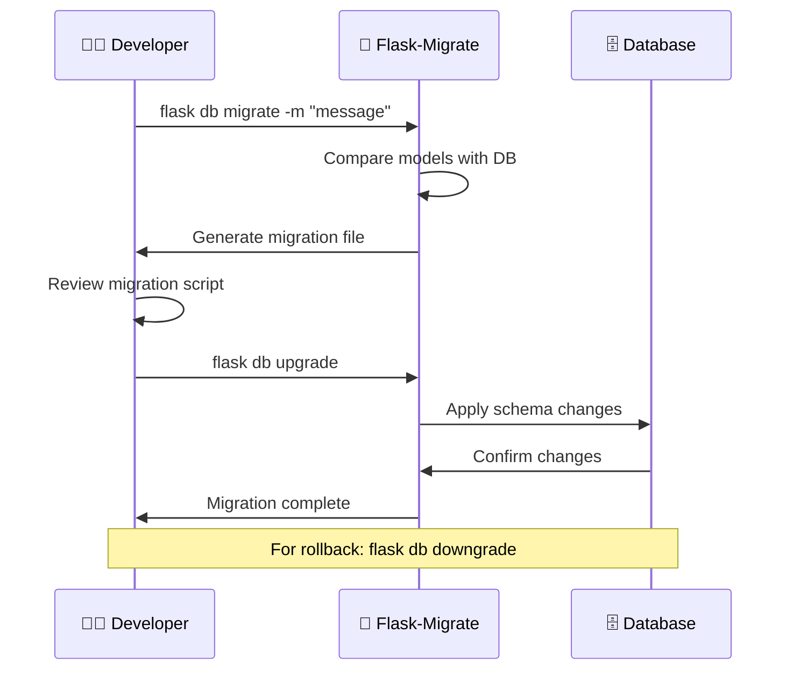

### 🧪 Testing Strategy Mind Map
```
                    🧪 TESTING STRATEGY
                           │
        ┌──────────────────┼──────────────────┐
        │                  │                  │
    🎭 ROLE TESTING   🔧 UNIT TESTS    🌐 INTEGRATION
        │                  │                  │
    ┌───┴───┐          ┌───┴───┐          ┌───┴───┐
    │       │          │       │          │       │
  Admin   Student    Models  Routes    End-to-End Browser
  Tests   Tests      Tests   Tests     Testing    Testing
    │       │          │       │          │       │
  Perms   Checkout   User    Auth      Full      UI/UX
  Check   Flow       CRUD    Flow      Workflow  Testing
  Mgmt    Books      Book    Login     Scenarios Responsive
  Tools   Renew      Logic   Logout    API       Mobile
```

### 🧪 Testing Different Roles
Create test users for each role to verify functionality:
```python
# In Flask shell or script
admin_user = User(email='admin@test.com', role='Admin', ...)
incharge_user = User(email='incharge@test.com', role='Incharge', ...)
volunteer_user = User(email='volunteer@test.com', role='Volunteer', ...)
student_user = User(email='student@test.com', role='Student', ...)
```

## 🚨 Common Issues & Solutions

### 🔧 Database Issues
- **Migration Conflicts**: Delete migration files and recreate
- **Foreign Key Errors**: Check relationship definitions
- **Data Integrity**: Use database constraints

### 🌐 Frontend Issues
- **Bootstrap Conflicts**: Check CSS load order
- **JavaScript Errors**: Use browser dev tools
- **Mobile Responsiveness**: Test on different screen sizes

### 🔐 Authentication Problems
- **Session Timeout**: Check `permanent_session_lifetime`
- **CSRF Errors**: Ensure forms include CSRF tokens
- **Permission Denied**: Verify role-based decorators

## 📚 Learning Resources

### 🎓 Flask Ecosystem
- [Flask Documentation](https://flask.palletsprojects.com/)
- [SQLAlchemy ORM Guide](https://docs.sqlalchemy.org/en/20/orm/)
- [Flask-Login Tutorial](https://flask-login.readthedocs.io/)
- [Bootstrap 5 Components](https://getbootstrap.com/docs/5.0/components/)

### 🛠️ Development Tools
- **Database Browser**: SQLite Browser for local development
- **API Testing**: Postman or curl for endpoint testing
- **Code Quality**: Use linters like flake8 or black
- **Version Control**: Git best practices

## 🎯 Next Steps

### 🚀 Getting Started Tasks
1. **Set up development environment** following the Quick Start Guide
2. **Create test users** for each role
3. **Explore the codebase** starting with `models.py` and `__init__.py`
4. **Run the application** and navigate through different dashboards
5. **Make a small change** to understand the development workflow

### 🔍 Areas to Explore
- **Blueprint Structure**: How routes are organized
- **Template Inheritance**: How UI components are reused
- **Database Relationships**: How models connect
- **Permission System**: Role-based access implementation

---

## 🎉 Welcome to the Team!

You're now ready to start contributing to LMS-Dblock! Remember:
- **Ask questions** - the team is here to help
- **Start small** - make incremental changes
- **Test thoroughly** - verify changes across all user roles
- **Document changes** - update this guide as needed

Happy coding! 🚀## 
🎨 Visual Project Summary

### 🏗️ Complete System Architecture
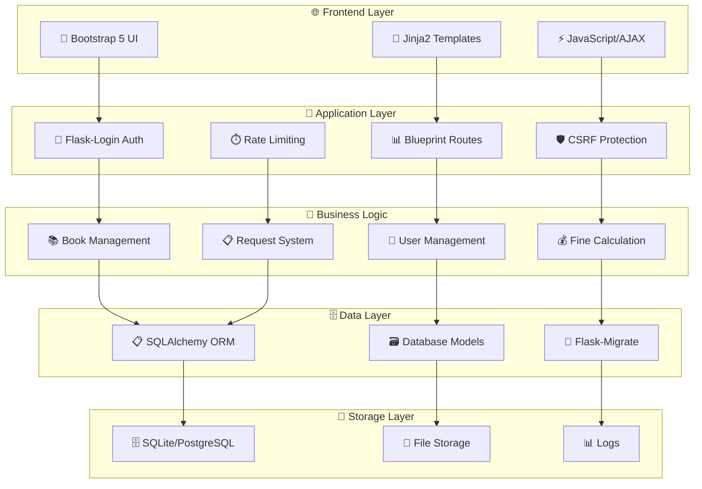

### 🔄 Complete Data Flow Visualization
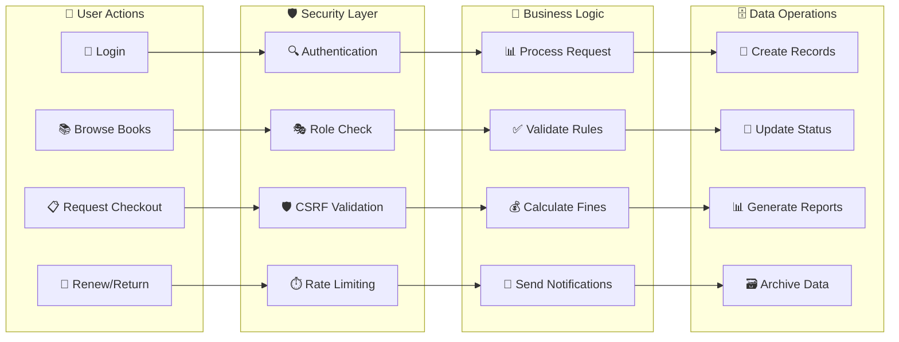

### 🎯 Feature Complexity Matrix
```
                    COMPLEXITY vs FREQUENCY
                           │
                    HIGH   │   LOW
                FREQUENCY │ FREQUENCY
            ┌─────────────┼─────────────┐
       HIGH │ 🔥 CRITICAL │ ⚡ OPTIMIZE │
 COMPLEXITY │             │             │
            │ • User Auth │ • Analytics │
            │ • Book CRUD │ • Reports   │
            │ • Checkout  │ • Exports   │
            ├─────────────┼─────────────┤
        LOW │ 🎯 ENHANCE  │ 💡 AUTOMATE │
 COMPLEXITY │             │             │
            │ • UI Polish │ • Cleanup   │
            │ • Validation│ • Logging   │
            │ • Messages  │ • Backups   │
            └─────────────┴─────────────┘
```

### 🚀 Quick Reference Command Cheat Sheet
```
┌─────────────────────────────────────────────────────────┐
│ 🛠️ DEVELOPMENT COMMANDS                                 │
├─────────────────────────────────────────────────────────┤
│ Setup & Installation                                    │
│ • python -m venv .venv                                  │
│ • .venv\Scripts\activate                                │
│ • pip install -r requirements.txt                      │
├─────────────────────────────────────────────────────────┤
│ Database Operations                                     │
│ • flask db init                                         │
│ • flask db migrate -m "message"                        │
│ • flask db upgrade                                      │
│ • flask db downgrade                                    │
├─────────────────────────────────────────────────────────┤
│ Running the Application                                 │
│ • python LMS_app.py                                     │
│ • gunicorn -w 4 -b 0.0.0.0:8000 LMS_app:app           │
├─────────────────────────────────────────────────────────┤
│ Git Workflow                                            │
│ • git checkout -b feature/branch-name                   │
│ • git add . && git commit -m "message"                  │
│ • git push origin feature/branch-name                   │
│ • git checkout main && git merge feature/branch-name    │
└─────────────────────────────────────────────────────────┘
```

### 🎓 Learning Path Roadmap
```mermaid
journey
    title New Developer Learning Journey
    section Week 1: Setup & Basics
      Environment Setup: 3: Developer
      Explore Codebase: 4: Developer
      Understand Models: 5: Developer
      Run Application: 5: Developer
    section Week 2: Core Features
      User Authentication: 4: Developer
      Book Management: 5: Developer
      Role System: 4: Developer
      Database Operations: 3: Developer
    section Week 3: Advanced Features
      Fine Calculations: 3: Developer
      Request System: 4: Developer
      Reporting: 3: Developer
      API Integration: 2: Developer
    section Week 4: Mastery
      Performance Optimization: 4: Developer
      Security Best Practices: 5: Developer
      Testing Strategies: 4: Developer
      Deployment: 5: Developer
```

---

## 🎉 Congratulations!

You now have a comprehensive visual guide to the LMS-Dblock system! This document includes:

✅ **System Architecture** with detailed diagrams  
✅ **Database Schema** with ERD and relationships  
✅ **User Workflows** with state diagrams  
✅ **Role-based Dashboards** with layout mockups  
✅ **Development Process** with Git workflows  
✅ **Visual Navigation** with flowcharts  
✅ **Quick Reference** commands and cheat sheets  

### 🚀 Ready to Start?

1. **Set up your environment** using the Quick Start Guide
2. **Create test users** for each role to explore functionality
3. **Follow the learning path** to gradually understand the system
4. **Use the visual diagrams** as reference while coding
5. **Ask questions** and contribute to improving this documentation

**Happy coding and welcome to the team!** 🎊